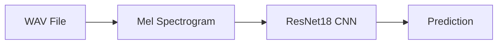
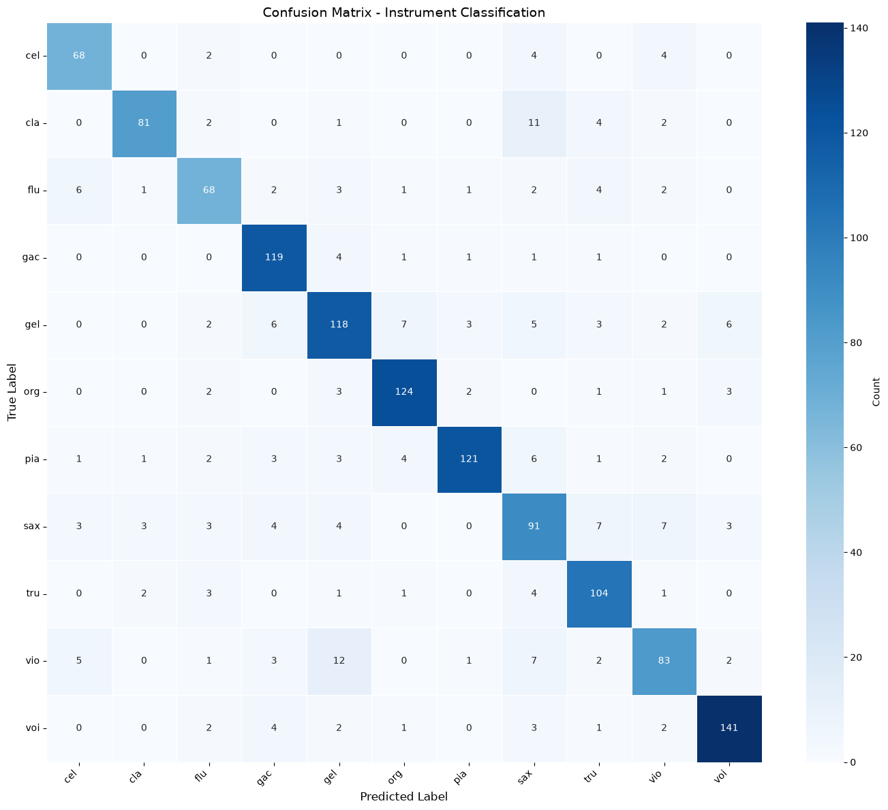

## Single Label Instrument ID using transfer learning and the IRMAS Dataset
Using ResNet18, I created a model that classifies audio clips of 11 different instruments, with 83% accuracy.
---
#### Results at a glance:

| Instrument       | Validation Accuracy |
|------------------|---------------------|
| Cello            | 87.18%              |
| Clarinet         | 80.20%              |
| Flute            | 75.56%              |
| Acoustic Guitar  | 93.70%              |
| Electric Guitar  | 77.63%              |
| Organ            | 91.18%              |
| Piano            | 84.03%              |
| Saxophone        | 72.80%              |
| Trumpet          | 89.66%              |
| Violin           | 71.55%              |
| Voice            | 90.38%              |
| **Overall**      | **83.08%**          |

### Problem and Approach
My model processes ~2 second .wav files from the [IRMAS Dataset](https://www.upf.edu/web/mtg/irmas), and classifies the audio with a single instrument label. Initially I designed a custom CNN, which struggled to break through 75% validation accuracy. After pivoting to transfer learning using the ResNet18 model, the model was able to achieve 83% validation accuracy.

### Pipeline

### Tech Stack
- Librosa (audio-spectrogram conversions)
- PyTorch (transfer learning with pretrained ResNet18)
- Seaborn (rednering confusion matrix)
- scikit-learn (confusion matrix stats)

### Confusion Matrix

### Issues and Limitations:

1) The model achieves a training accuracy of ~90% while validation accuracy plateaus at ~80%. Even with aggressive dropout and data augmentation, it's difficult to push validation accuracy higher than 83% and avoid overfitting.

2) The IRMAS dataset is not equally distributed across all 11 labels of instruments. Looking at our confusion matrix, the model performs slightly better on some instruments and worse on others. If the 80-20 datasplit happens to disproportionately favor certain instruments, accuracy can be improved or worsened as a result. It's final accuracy varies ~&pm;2% across different instances of training.
